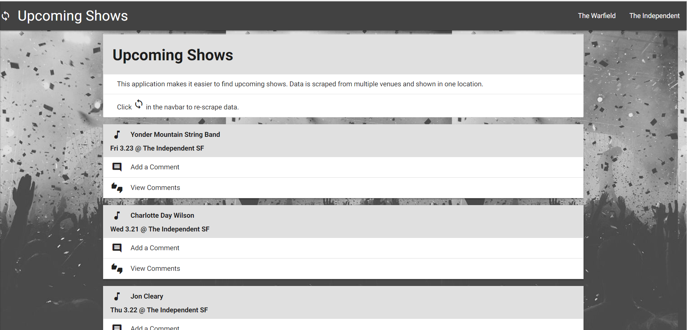
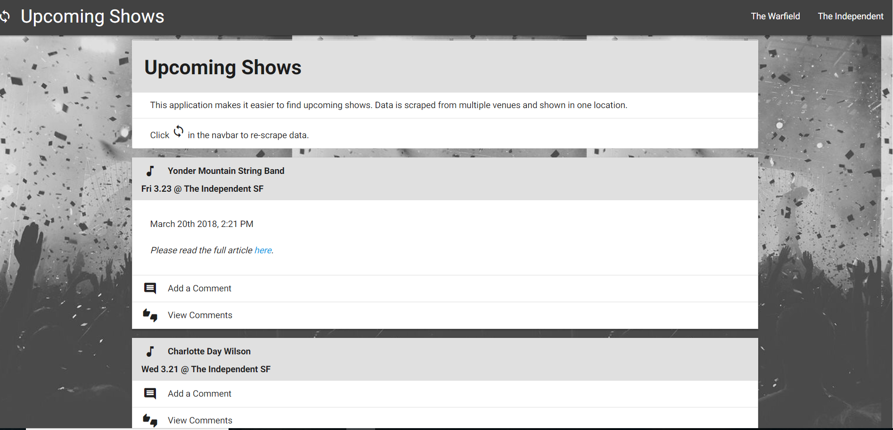
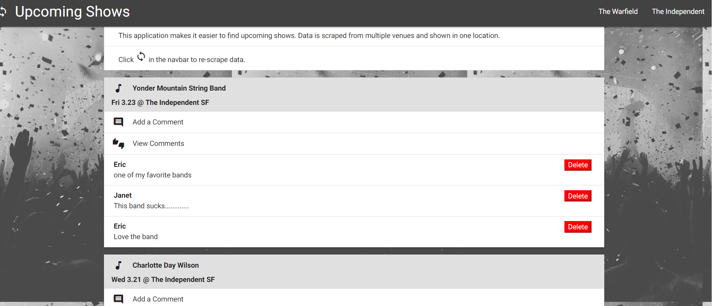
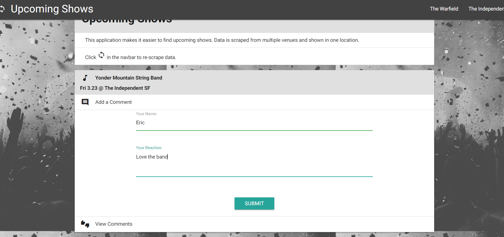
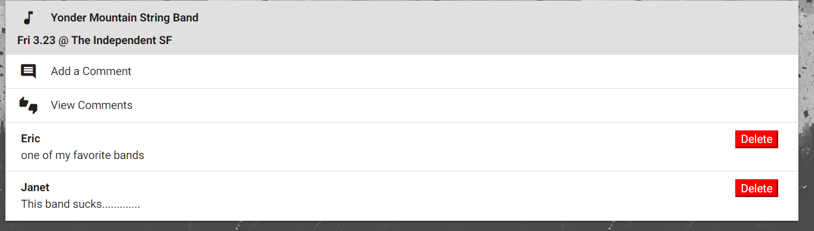

# Warfield-Webscraper

I create a web app that lets users view and leave comments on local events held at 2 venues, using Mongoose and Cheerio to scrape news from 2 sites.

## Live Site Link

---
## Screen Shots

## Technologies Used
-express
-express-handlebars
-mongoose
-body-parser
-cheerio
-request

